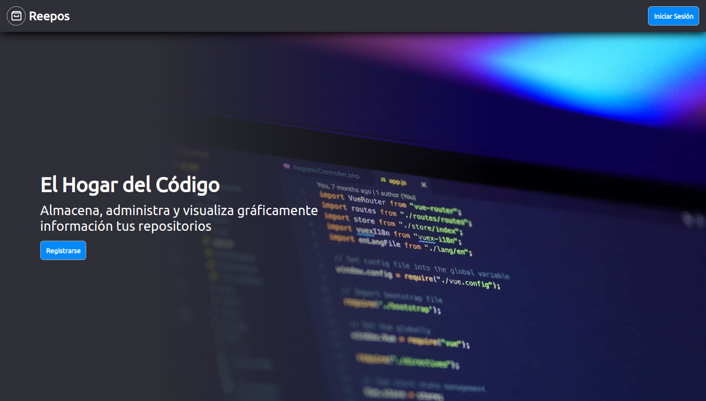

<h1 align="center">Reepos Frontend</h1>

# Introducción 🚀

Este el repositorio del frontend del proyecto **Reepos** (una **webapp** basada en [Github](https://github.com)), desarrollado
siguiendo la arquitectura **MPA** (**M**ultiple **P**age **A**pplication) y usando **cookies** para la autenticación.

## Tecnologías 💻️

- **Vanilla Javascript**
- **Vanilla CSS**

## Screenshots 📷️

### Escritorio

